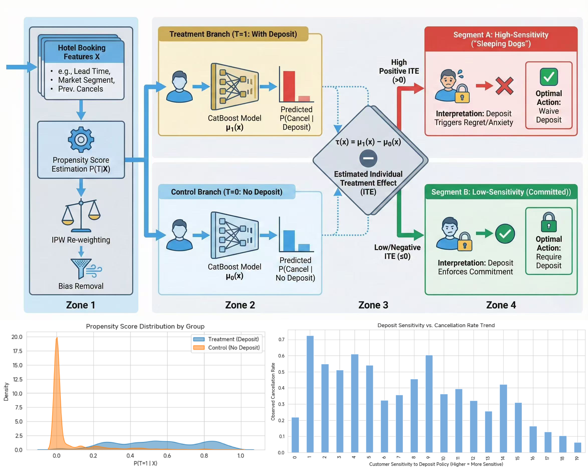
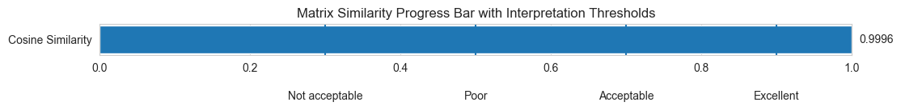
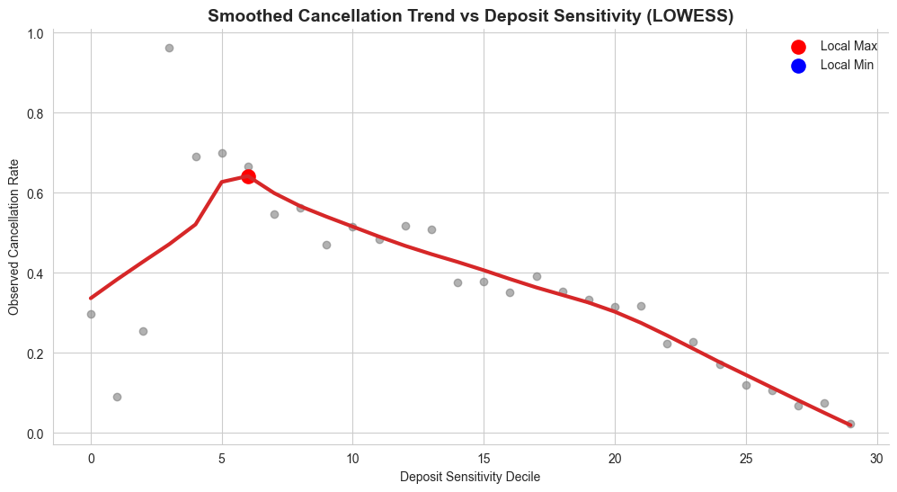
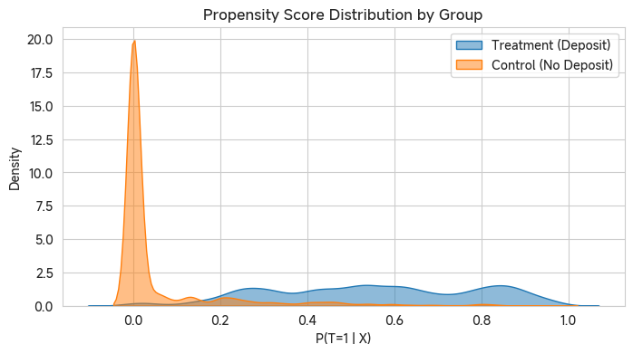
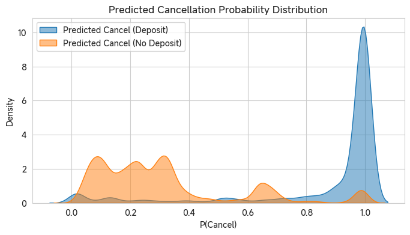

# Hotel Deposit Uplift Modeling: Causal Inference for Revenue Management

   

> **"Deposits do not discipline behavior — they select for behavior."**

This project applies **Causal Uplift Modeling (Heterogeneous Treatment Effect / ITE)** to the hotel booking domain. Instead of the traditional "will they cancel?" prediction, we answer the ROI-critical question: **"How will the probability of cancellation change if we enforce (or waive) a deposit for this specific user?"**

By quantifying this **causal difference**, we identify sub-populations where deposit policies backfire, enabling a differentiated strategy that maximizes revenue retention.

## 🔥 Executive Summary & Behavioral Economics

**Key Discovery:** Deposit policies do **not** reduce cancellations uniformly. The population exhibits heterogeneous responses best explained by **Prospect Theory**:

1.  **🚫 The "Sleeping Dogs" (High-Sensitivity)**:
    * **Behavior:** Committed planners who view deposits not as sunk costs, but as potential losses (**Loss Aversion**).
    * **Impact:** Enforcing a deposit triggers anxiety/regret, causing them to cancel bookings they would otherwise have kept.
    * **Action:** **Waive Deposit**.

2.  **✅ The "Persuadables" (Low-Sensitivity)**:
    * **Behavior:** Impulsive users with low planning stability.
    * **Impact:** The deposit acts as a "Commitment Device," significantly reducing their cancellation rate.
    * **Action:** **Require Deposit**.

**Conclusion:** A uniform deposit policy destroys value by waking "Sleeping Dogs." An Uplift-based policy captures value by targeting "Persuadables."

> **Validation:** Counterfactual predictions match real-world cancellation behavior at **0.999+ correlation**, confirming the causal validity of the model structure.

---

## 🛠 High-Level Workflow

| Step | Method | Purpose |
| :--- | :--- | :--- |
| **1. Treatment Definition** | `T = (deposit_type != "No Deposit")` | Frame as Observational A/B Test |
| **2. Bias Correction** | **Propensity Score + IPW** | Remove confounding selection bias ($P(T \mid X)$) |
| **3. Causal Learning** | **T-Learner (CatBoost)** | Estimate counterfactual outcomes ($Y_1, Y_0$) |
| **4. Uplift Computation** | `ITE = P(Cancel|Deposit) - P(Cancel|No Deposit)` | Quantify individual causal impact |
| **5. Segmentation** | **Uplift Deciles** | Group users for policy targeting |

### 🧮 Core Equations

%20%3D%20P\(%5Ctext%7Bcancel%7D%20%5Cmid%20%5Ctext%7Bdeposit%7D%2C%20x\)%20-%20P\(%5Ctext%7Bcancel%7D%20%5Cmid%20%5Ctext%7Bno-deposit%7D%2C%20x\))

where `x` represents customer-level covariates (e.g., lead time, market segment, prior cancellations).

---

#### 1️⃣ Individual Treatment Effect (ITE)

%20%3D%20E%5BY\(1\)%20-%20Y\(0\)%20%7C%20X%20%3D%20x%5D)

Here `Y(1)` is the outcome (cancellation) if the user **pays a deposit**, and `Y(0)` if **no deposit** is required.
Since only one of the two outcomes is observed per user, we estimate both via counterfactual modeling.

---

#### 2️⃣ Propensity Score and IPW Balancing

%20%3D%20P\(T%3D1%20%7C%20X%3Dx\))

Weights to correct for treatment-assignment bias:

%7D%2C%20%26%20T_i%3D1%20%5C%5C%20%5Cfrac%7B1%7D%7B1-e\(x_i\)%7D%2C%20%26%20T_i%3D0%20%5Cend%7Bcases%7D)

Weights `wᵢ` correct for treatment-assignment bias (self-selection), ensuring covariate balance between deposit and no-deposit groups.

---

#### 3️⃣ T-Learner (Two-Model Estimation)

We fit two independent models:

%20%3D%20%5Chat%7BP%7D\(Y%3D1%20%5Cmid%20T%3D1%2C%20X%3Dx\)%20%5Cquad%20%5Ctext%7Band%7D%20%5Cquad%20%5Chat%7Bf%7D_0\(x\)%20%3D%20%5Chat%7BP%7D\(Y%3D1%20%5Cmid%20T%3D0%2C%20X%3Dx\))

Then the **uplift score** for each customer is:

%20%3D%20%5Chat%7Bf%7D_1\(x\)%20-%20%5Chat%7Bf%7D_0\(x\))

### 🔍 Core Empirical Findings

### 1. Heterogeneous Treatment Effects (HTE)
The model successfully separated users into distinct causal segments:

| Segment              | Industry Term       | Psychological Profile        | Effect of Deposit (ITE)                             | Optimal Action      |
| :------------------- | :------------------ | :--------------------------- | :-------------------------------------------------- | :------------------ |
| **High Sensitivity** | **"Sleeping Dogs"** | Risk-averse, prone to regret | **Positive (>0)**   *(Deposit increases cancel)* | **Waive Deposit**   |
| **Low Sensitivity**  | **"Persuadables"**  | Low commitment, transient    | **Negative (<0)**   *(Deposit reduces cancel)*   | **Require Deposit** |

### 2. Structural Validation
Comparing the model's *counterfactual* predictions against observed data for extreme deciles:

| Group             | Predicted $P(Y \mid \text{No Dep})$ | Predicted $P(Y \mid \text{Dep})$ | Observed $P(Y \mid \text{No Dep})$ | Observed $P(Y \mid \text{Dep})$ |
| :---------------- | :---------------------------------- | :------------------------------- | :--------------------------------- | :------------------------------ |
| **Sleeping Dogs** | 17.1%                               | **99.1%**                        | 15.3%                              | **99.9%**                       |
| **Persuadables**  | 19.8%                               | **4.1%**                         | 20.3%                              | **6.0%**                        |

✅ Pearson Similarity = **0.9993**  
✅ Cosine Similarity = **0.9996**  
→ Model is **structurally aligned** with real behavior → uplift segmentation is **valid**.

### 3. Observed Cancellation Rate (Real Behavior)

| **User Group**              | **No Deposit (Observed)** | **Deposit (Observed)** | **Causal Effect (Policy Impact)** |
| --------------------------- | ------------------------- | ---------------------- | --------------------------------- |
| **High-Uplift** (Top 20%)   | 15.3%                     | 99.9%                  | **+84.6 p.p.** (Backfire)         |
| **Low-Uplift** (Bottom 20%) | 20.3%                     | 6.0%                   | **-14.3 p.p.** (Effective)        |

#### Behavioral Interpretation

**Deposits do not discipline behavior — they *select for* behavior.**

- High-sensitivity users were going to **show commitment anyway** → forcing deposit **breaks** that commitment.
- Low-sensitivity users were **not committed** → deposit **creates** commitment.

> **Uniform deposit policy = value destruction**  
> **Uplift-based differentiated policy = value creation**

## 💼 Business Playbook (Actionable)

Based on the uplift score, we recommend the following differential strategies:

| Customer Signal                                     | Segment           | Recommended Action                                           |
| :-------------------------------------------------- | :---------------- | :----------------------------------------------------------- |
| **High lead time, Special requests, Repeat guests** | **Sleeping Dogs** | **"Silent Closing" (静默成交)** Waive deposit & suppress post-booking marketing to avoid cognitive dissonance. |
| **Short lead time, History of cancels, Transient**  | **Persuadables**  | **"Commitment Lock"** Require non-refundable deposit or Deposit-as-Credit to enforce stability. |

## 📦 Dataset & Tech Stack

* **Source:** `./archive_8/hotel_bookings.csv` (119,390 bookings)
* **Key Features:** `lead_time`, `market_segment`, `previous_cancellations`, `total_of_special_requests`, `days_in_waiting_list`.
* **Stack:** Python, CausalML / Scikit-Learn, CatBoost, SHAP (for interpretability).

> **Note:** The dataset is excluded via `.gitignore`. Please download the standard Hotel Booking Demand dataset.

## 🧪 Methodology

* **Design:** Observational causal study with **Propensity Scores** and **Inverse Probability Weighting (IPW)** to reduce selection bias.
* **Learner:** **T-Learner** with **Gradient Boosting**:

  * Train **f₁(x)** on treated (deposit=1) with IPW.
  * Train **f₀(x)** on controls (deposit=0) with IPW.
  * Compute **uplift = f₁(x) − f₀(x)** for each user.
* **Features (examples):** `lead_time`, `market_segment`, `previous_cancellations`, `booking_changes`, `total_of_special_requests`, `days_in_waiting_list`, one-hot hotel/segment dummies.

**Why uplift (vs. plain classification)?**
It answers *“what changes if we add/remove the deposit?”* instead of *“who cancels?”*, enabling **policy targeting** and **ROI-aware interventions**.

## 📓 Notebook Outline

1.  **Data Loading & Sanity Checks:** Schema validation.
2.  **Naïve A/B Analysis:** Why simple averaging fails.
3.  **Causal Feature Engineering:** Propensity modeling ($P(T|X)$).
4.  **IPW Weighting:** Balancing the covariate distributions.
5.  **T-Learner Training:** Dual CatBoost implementation.
6.  **Uplift Evaluation:** Decile charts, Qini curves (implied), and Policy attribution.

## 🛡️ Caveats & Future Work

* **Unobserved Confounders:** As an observational study, we assume *strong ignorability*. Hidden variables (e.g., price at time of booking) could influence results.
* **Validation:** While OOT (Out-of-Time) validation is strong, a randomized control trial (RCT) is recommended for final policy calibration.

## 📜 License

MIT (code). Dataset license follows its original source.

**Contact:** [GitHub @republic1024](https://github.com/Republic1024)
*Open to collaboration on Quantitative Finance, Causal Inference, and Decision Intelligence.*
