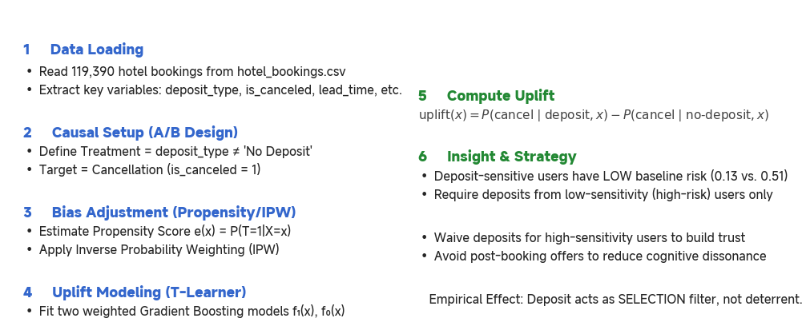
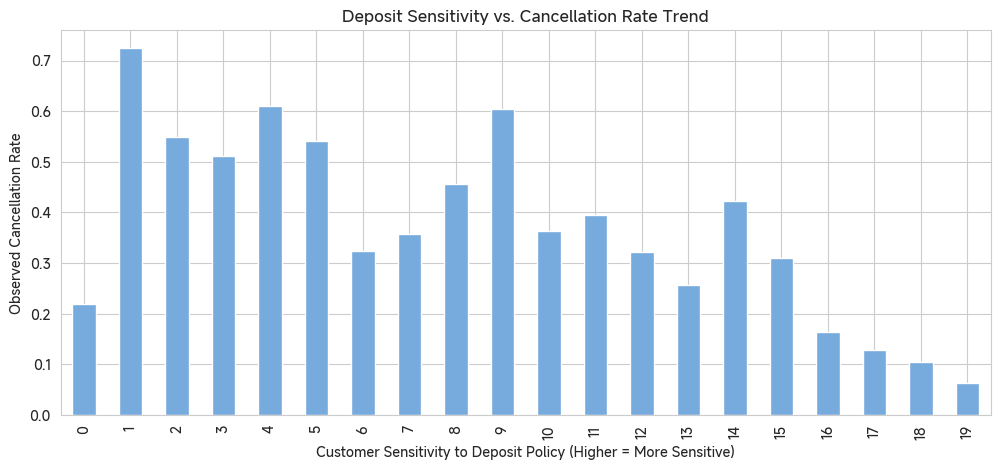

# Hotel Deposit Uplift Modeling

**Causal Inference · Customer Behavior Analytics · Observational A/B**

This project uses **uplift modeling (heterogeneous treatment effect / ITE)** to estimate how **deposit policy** (`deposit_type`) affects **booking cancellations** (`is_canceled`) on a per-user basis. Rather than predicting “who cancels,” we quantify **the causal *difference***.

### 🧮 Core Equations

%20%3D%20P\(%5Ctext%7Bcancel%7D%20%5Cmid%20%5Ctext%7Bdeposit%7D%2C%20x\)%20-%20P\(%5Ctext%7Bcancel%7D%20%5Cmid%20%5Ctext%7Bno-deposit%7D%2C%20x\))

where `x` represents customer-level covariates (e.g., lead time, market segment, prior cancellations).

---

#### 1️⃣ Individual Treatment Effect (ITE)

%20%3D%20E%5BY\(1\)%20-%20Y\(0\)%20%7C%20X%20%3D%20x%5D)

Here `Y(1)` is the outcome (cancellation) if the user **pays a deposit**, and `Y(0)` if **no deposit** is required.
Since only one of the two outcomes is observed per user, we estimate both via counterfactual modeling.

---

#### 2️⃣ Propensity Score and IPW Balancing

%20%3D%20P\(T%3D1%20%7C%20X%3Dx\))

Weights to correct for treatment-assignment bias:

%7D%2C%20%26%20T_i%3D1%20%5C%5C%20%5Cfrac%7B1%7D%7B1-e\(x_i\)%7D%2C%20%26%20T_i%3D0%20%5Cend%7Bcases%7D)

Weights `wᵢ` correct for treatment-assignment bias (self-selection), ensuring covariate balance between deposit and no-deposit groups.

---

#### 3️⃣ T-Learner (Two-Model Estimation)

We fit two independent models:

%20%3D%20%5Chat%7BP%7D\(Y%3D1%20%5Cmid%20T%3D1%2C%20X%3Dx\)%20%5Cquad%20%5Ctext%7Band%7D%20%5Cquad%20%5Chat%7Bf%7D_0\(x\)%20%3D%20%5Chat%7BP%7D\(Y%3D1%20%5Cmid%20T%3D0%2C%20X%3Dx\))

Then the **uplift score** for each customer is:

%20%3D%20%5Chat%7Bf%7D_1\(x\)%20-%20%5Chat%7Bf%7D_0\(x\))

### 📈 Results Snapshot

| Metric                                      | Description                                  | Value      |
| ------------------------------------------- | -------------------------------------------- | ---------- |
| **f₁ (deposit)** accuracy                   | Model accuracy on deposit group              | **0.998**  |
| **f₀ (no-deposit)** accuracy                | Model accuracy on no-deposit group           | **0.783**  |
| **Average uplift**                          | Mean estimated treatment effect across users | **+0.556** |
| **High-uplift group baseline cancel prob.** | Predicted cancellation rate under no deposit | **0.1306** |
| **Low-uplift group baseline cancel prob.**  | Predicted cancellation rate under no deposit | **0.5131** |

### ✨ Key Findings

#### 🔍 Interpretation

- **High-uplift users** → more *sensitive* to deposit policy but already stable (low baseline cancel rate).
   → They don’t need deposits — waive or make optional.
- **Low-uplift users** → less sensitive but more volatile (high baseline cancel rate).
   → Require deposits or non-refundable bookings to enforce commitment.

#### 🎯 Policy Insight

> Deposit acts as a **selection filter**, not a deterrent.
>
> - Require deposits for **low-sensitivity** (high-risk) users.
> - Waive deposits for **high-sensitivity** (low-risk) users.
> - Suppress post-booking offers for high-uplift users to prevent regret-induced cancellations.

## 📦 Dataset

* **File:** `./archive_8/hotel_bookings.csv`
* **Size:** 119,390 bookings, 32 columns
* **Notable fields:** `deposit_type`, `is_canceled`, `lead_time`, `customer_type`, `market_segment`, `previous_cancellations`, `booking_changes`, `total_of_special_requests`, `days_in_waiting_list`, etc.

> **Note:** The dataset is excluded via `.gitignore` (`archive_8/`, `archive_8.zip`). Place the CSV at the path above before running.

## 🧪 Methodology

* **Design:** Observational causal study with **Propensity Scores** and **Inverse Probability Weighting (IPW)** to reduce selection bias.
* **Learner:** **T-Learner** with **Gradient Boosting**:

  * Train **f₁(x)** on treated (deposit=1) with IPW.
  * Train **f₀(x)** on controls (deposit=0) with IPW.
  * Compute **uplift = f₁(x) − f₀(x)** for each user.
* **Features (examples):** `lead_time`, `market_segment`, `previous_cancellations`, `booking_changes`, `total_of_special_requests`, `days_in_waiting_list`, one-hot hotel/segment dummies.

**Why uplift (vs. plain classification)?**
It answers *“what changes if we add/remove the deposit?”* instead of *“who cancels?”*, enabling **policy targeting** and **ROI-aware interventions**.

## 📓 Notebook Outline

* **Cell 1 — Data loading & project scaffold**: shape, columns, sanity checks.
* **Cell 2 — Naïve A/B**: raw difference in cancel rates.
* **Cell 3 — Feature prep**: one-hot, targets, treatment.
* **Cell 3.5 — Propensity score**: logistic regression (P(T=1\mid X)).
* **Cell 3.6 — IPW**: stabilized weights for treated/controls.
* **Cell 4 — Weighted T-Learner**: train **f₁**, **f₀** with sample weights.
* **Cell 4.1 — Fit sanity**: group-specific train accuracy (focus remains on effect estimation).
* **Cell 5 — Per-user uplift**: compute and describe distribution; deciles.
* **Cell 6 — Decile analysis**: cancellation vs. uplift deciles; baseline risk check.

## 📈 Sanity Checks (illustrative)

* **Group fits (train)**: f₁ (treated) ≈ **0.998**, f₀ (control) ≈ **0.783**.
  *Note:* these are **not** the objective; the goal is **credible effect estimation**, not max classification accuracy.

## 🧠 Business Playbook

* **Low-sensitivity users** (high baseline risk): require **deposit / non-refundable** or use **deposit-as-credit** mechanisms to lock commitment.
* **High-sensitivity users** (low baseline risk): **waive deposit** and **avoid post-booking promotions** to prevent cognitive dissonance and cancellations.

## 🛡️ Caveats

* Observational data → relies on **unconfoundedness** given features; hidden confounders may remain.
* Always A/B validate policy before full rollout (e.g., staggered or geo experiments).

## 📜 License

MIT (code). Dataset license follows its original source.

**Contact:** [GitHub @republic1024](https://github.com/Republic1024) · For academic/industry collaboration on decision intelligence & causal uplift modeling.
